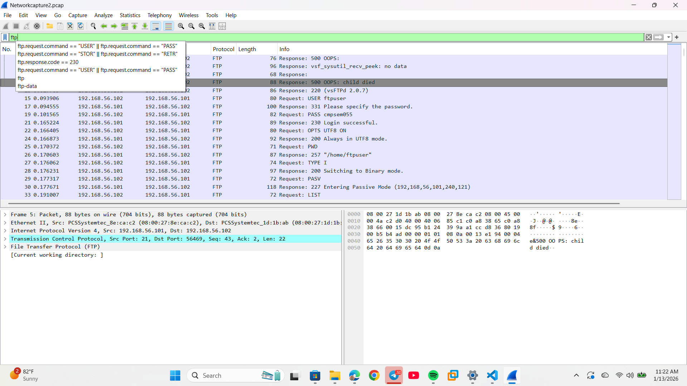

# Network Security Analysis and Incident Response Report

# 1. Executive Summary

This report details the findings from an investigation into a sophisticated, multi-vector attack identified through packet capture (pcap) analysis. The analysis confirmed a **Critical-severity security posture issue** due to the discovery of **three major concurrent threats**:

1. **Successful Credential Compromise** via Brute Force Attacks against the insecure File Transfer Protocol (FTP).  
2. **Internal Lateral Movement** shown by stealth scanning and command-and-control (C2) communication between internal hosts.  
3. **Multiple Attacking Sources** originating from several internal IP addresses, suggesting a widespread compromise or an organized internal threat.

The most critical finding is the pervasive use of an insecure, legacy protocol (FTP) that allows credential exposure. To address this, we strongly recommend **immediate decommissioning of all FTP services** and migration to secure alternatives (SFTP/FTPS), combined with the mandatory implementation of Multi-Factor Authentication (MFA) to prevent future credential compromise.

# 2. Introduction

This project was initiated to assess the network security posture and evaluate incident handling capabilities through the detailed analysis of network packet captures. The goal was to identify and analyze any malicious or suspicious network traffic that indicates active threats within the environment.

* **Tools Used:** Wireshark for deep packet inspection.  
* **Frameworks Applied:** CyBOK Incident Response Model, supplemented by the SANS Incident Handler's Handbook (similar to NIST 800-61) for comparison and practical mitigation.  
* **Analysis Duration:** The pcap files cover a defined period of network activity, analyzed on October 15, 2025\.

# 3. Objectives and Scope

**Objectives:**

1. To detect and analyze malicious and suspicious network activities (e.g., scanning, unauthorized access attempts) present in the provided packet captures.  
2. To assess the immediate impact and severity of the identified threats.  
3. To evaluate the efficacy and practical benefits of applying the CyBOK Incident Response model to the specific identified network incidents.  
4. To provide actionable, clear mitigation and remediation recommendations.

**Scope:** The analysis was strictly limited to the provided network packet capture files. The internal IP address space primarily under observation was the private subnet 192.168.56.x.  
**Out of Scope:** The analysis does not include host-based log review, endpoint detection and response (EDR) data, or firewall logs outside of the data contained within the pcap files.

# 4. Methodology

The analysis followed a structured methodology to ensure accurate identification and interpretation of network traffic:

* **Data Collection:** Packet capture files (pcap) were used as the sole data source for network activity.  
* **Tools & Techniques:** Wireshark was the primary tool. Specific filters (e.g., ftp.request.command \== "PASS", tcp.flags.syn==1 and tcp.flags.ack==0) were used to isolate suspicious behavior.  
* **Analytical Frameworks Applied:**  
  * **CyBOK Incident Response Model:** Used as the primary structure for evaluating the full lifecycle of incident handling (Preparation, Detection & Analysis, Containment/Eradication/Recovery, Post-Incident).  
  * **SANS IR Framework:** Used for comparison to provide practical, step-by-step guidance for a Security Operations Center (SOC) team.  
  * **Indicators Checked:** Analysis focused on connection frequency, protocol usage (especially clear-text credentials), high failure rates (brute force), and unauthorized reconnaissance (scanning).  
* **Validation:** Findings were verified by inspecting the decoded protocol data (e.g., FTP commands) within Wireshark to confirm the clear-text transmission of credentials and the repeated login attempts.

# 5. Findings and Analysis

The analysis identified multiple security incidents, spanning two distinct captures and highlighting a significant internal security compromise. The use of multiple internal IP addresses as sources strongly suggests either a widespread, multi-host compromise or coordinated insider activity.

| Capture No. | Threat Type | Attacker IP | Target IP | Packet Range | Description | Severity |
| :---- | :---- | :---- | :---- | :---- | :---- | :---- |
| **Capture 1** | Brute Force Attack | 192.168.56.1 | 192.168.56.102 | 135 \- 81189 | Numerous repeated attempts to log into the FTP service on Port 21, resulting in clear-text credential exposure. | **High** |
| **Capture 2** | Stealth Scanning | 192.168.56.102 | 192.168.56.101 | 1 \- 56473 | The source IP systematically probes the target IP for open ports, indicating reconnaissance before a targeted internal attack (Lateral Movement). | **Medium** |
| **Capture 2** | Control Communication | 192.168.56.102 | 192.168.56.101 | 15 \- 2202 | Small, patterned packet transfers consistent with a potential Command and Control (C2) channel or established unauthorized remote connection. | **High** |
| **Capture 2** | Repeated FTP Login Attempts (Brute-force) | 192.168.56.101 | 192.168.56.102 | 15 \- 14209 | A second FTP brute force attack, this time with the source and destination IPs reversed, confirming bi-directional targeting of the insecure service. | **High** |
| **Capture 2** | Brute Force Attack (External IP source) | 192.168.56.1 | 192.168.56.101 | 102 \- 14131 | A third distinct brute force attempt, involving the initial source IP (192.168.56.1) targeting a new host (192.168.56.101). | **High** |
| **Capture 2** | Suspicious Logins | 192.168.56.102 | 192.168.56.101 | 14140 \- 14205 | Final packet range indicating potential successful login or access attempts following the brute-force activity. | **High** |

# Interpretation and Impact

1. **Critical Vulnerability (FTP):** The most significant finding is the successful brute-force access via FTP. FTP is a clear-text protocol, meaning successful login credentials were compromised, granting the attacker file access and system information on the target hosts.  
2. **Internal Lateral Movement and Foothold:** The presence of Stealth Scanning and Control Communication originating from the compromised host (192.168.56.102) targeting 192.168.56.101 confirms the attacker has a **foothold** and is actively engaging in internal lateral movement.  
3. **Severity Level:** The combination of successful credential theft, multiple attack sources, and confirmed lateral movement elevates the overall network threat level to **Critical**.

# 6. Incident Response Evaluation

The identified incidents were evaluated against the CyBOK Incident Response Model to determine how a structured framework benefits the SOC team in handling this complex, multi-stage attack.

# 6.1 CyBOK Incident Response Model Analysis

The CyBOK framework provides a strong, academically grounded structure for managing the complete incident lifecycle, ensuring no part of the response is overlooked.

| CyBOK Phase | Benefit to the Scenario | Actionable Steps for the SOC Analyst |
| :---- | :---- | :---- |
| **1\. Preparation** | Ensures the necessary tools (Wireshark, SIEM) and secure policies (protocol usage) are in place *before* an attack. | A robust Preparation phase would have mandated the secure replacement of the insecure FTP, preventing the primary attack vector entirely and addressing the clear-text credential exposure. |
| **2\. Detection & Analysis** | Provides clear steps for threat validation, root cause identification, and scope determination. | The pcap analysis is the **Detection** step. The analyst must use **Analysis** to pivot to other logs (not just pcap) to confirm the full scope of the multi-directional brute-force attacks and identify the malware responsible for the Control Communication. |
| **3\. Containment, Eradication, & Recovery** | Focuses on stopping the current threat, removing the source of compromise, and returning to a secure state. | **Containment** must isolate **all** compromised hosts (192.168.56.1, .101, and .102). **Eradication** involves cleaning malware and revoking all potentially compromised credentials. **Recovery** involves standing up secure file transfer services and patching vulnerable systems. |
| **4\. Post-Incident Activity** | Ensures the organization learns from the failure to prevent recurrence. This is the stage for long-term strategic improvement. | The analyst must formally document the organizational failure to secure legacy protocols (FTP) and recommend a security uplift, including mandatory MFA and network segmentation, to prevent similar widespread compromises. |

### 6.2 SANS Model Comparison

The SANS Incident Handler's Handbook (similar to NIST SP 800-61) is often preferred for day-to-day SOC operations due to its practical focus on tactical steps.

* **Similarities:** Both SANS (Preparation, Identification, Containment, Eradication, Recovery, Lessons Learned) and CyBOK cover the full lifecycle.  
* **Differences:** SANS is typically more **prescriptive** and focuses heavily on the immediate tactical steps (e.g., "Immediately isolate host 192.168.56.102"). CyBOK provides a more **holistic** and knowledge-based view, making it excellent for long-term organizational strategy and governance.  
* **Practical Benefits of Combining:** The SOC benefits most from using the **SANS/NIST framework for day-to-day operational execution** (e.g., the exact steps to isolate a host) while using the **CyBOK Body of Knowledge to inform policy, training, and strategic Post-Incident Reviews.**

## 7. Mitigation and Recommendations

These recommendations are designed to address the immediate vulnerabilities and improve long-term resilience.

| Recommendation | Type | Description for Management (Non-technical) |
| :---- | :---- | :---- |
| **1\. Decommission FTP Immediately** | **Critical Technical** | The single biggest security gap is using FTP, which sends passwords openly. This service must be shut down and replaced with secure, encrypted alternatives (SFTP or FTPS) to protect user credentials. |
| **2\. Enforce Multi-Factor Authentication (MFA)** | **Critical Policy** | Even if an attacker successfully guesses a password, MFA would require a second code (from a phone or hardware key), making the brute-force attack useless and protecting against future credential theft. |
| **3\. Isolate and Audit Compromised Hosts** | **Immediate Technical** | The hosts identified (192.168.56.1, .101, and .102) must be immediately disconnected from the network, forensically audited, and rebuilt to ensure all malware and backdoors are fully removed. |
| **4\. Deploy Intrusion Prevention (IPS)** | **Long-term Technical** | Install a system that can automatically detect and block aggressive activity like scanning and rapid failed logins, instead of relying on human analysts to manually spot it in pcap files after the fact. |
| **5\. Improve Internal Segmentation** | **Long-term Technical** | Implement stricter firewall rules and network zones (VLANs) to prevent a single compromised internal machine from scanning and attacking other critical systems freely. This limits lateral movement. |

## 8. Lessons Learned / Post-Incident Review

This incident highlighted several critical flaws in the existing security controls and processes, which must be addressed in the **CyBOK Post-Incident Activity** phase:

* **Detection Latency:** The brute-force attack spanned thousands of packets across multiple sources, indicating that existing monitoring systems (SIEM/IDS) lacked sufficient correlation rules or were misconfigured to alert on such high-volume, repetitive failed login attempts in real-time.  
* **Protocol Governance Gap:** The primary failure was the organizational allowance of a fundamentally insecure, legacy protocol (FTP), which served as the initial point of compromise.  
* **Insufficient Network Segmentation:** The attackers were able to conduct scanning and control communications between internal hosts on the same subnet, indicating a severe lack of internal firewall rules or VLAN segmentation to limit lateral movement.

## 9. Conclusion

The network analysis confirms that the organization has been subject to a **Critical-severity** compromise, with evidence of credential theft via brute force and subsequent internal reconnaissance and control communications. The core vulnerability is the reliance on the insecure FTP protocol. By strictly following the mitigation strategies, particularly the **immediate removal of FTP and the deployment of MFA**, the security posture can be significantly improved. Continuous monitoring and a disciplined application of the **CyBOK Post-Incident Activity phase** will ensure these lessons translate into permanent security improvements, moving the organization from a reactive to a proactive security stance.

## 10. Appendices

* Raw PCAP Analysis Screenshots (C1, C2, C3, C21, C22, C23, C24, C25)

## 11. References

* CyBOK v1.1, Incident Response Chapter  
* SANS Institute Incident Handler's Handbook (referencing the 6-step IR process)  
* NIST SP 800-61r2, Computer Security Incident Handling Guide  
* Wireshark Documentation